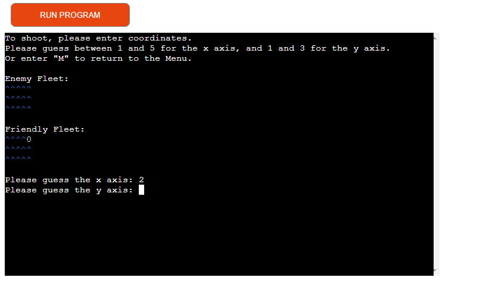
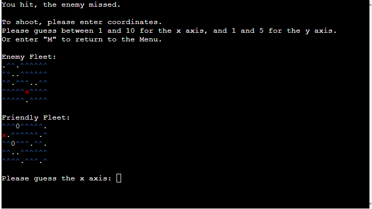
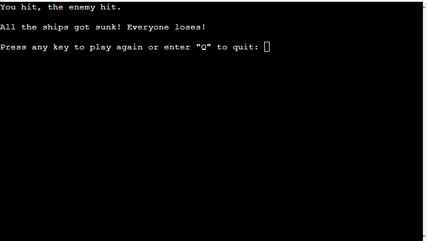
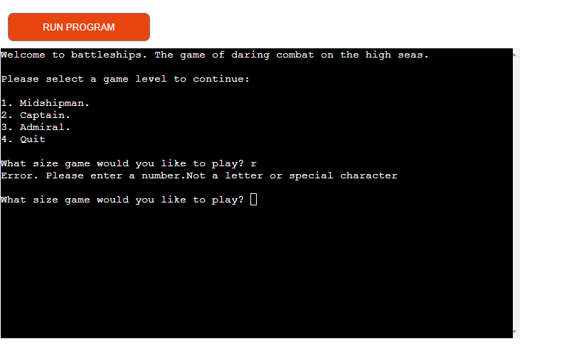
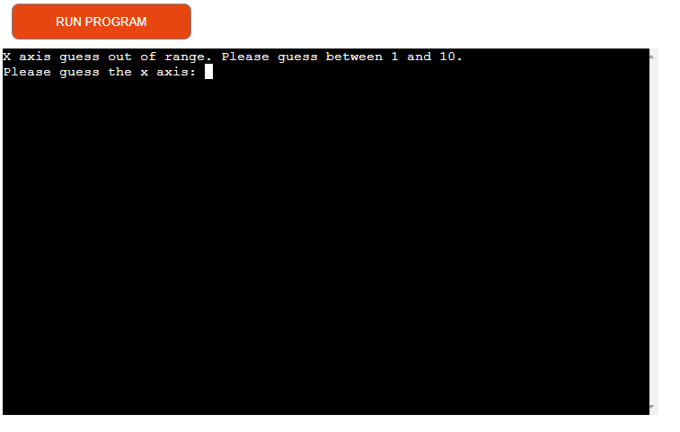
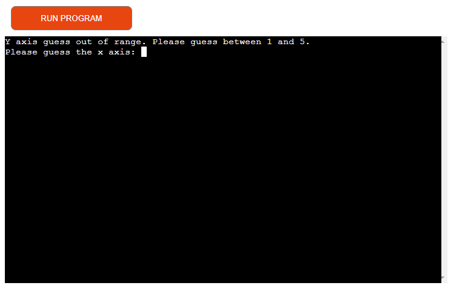
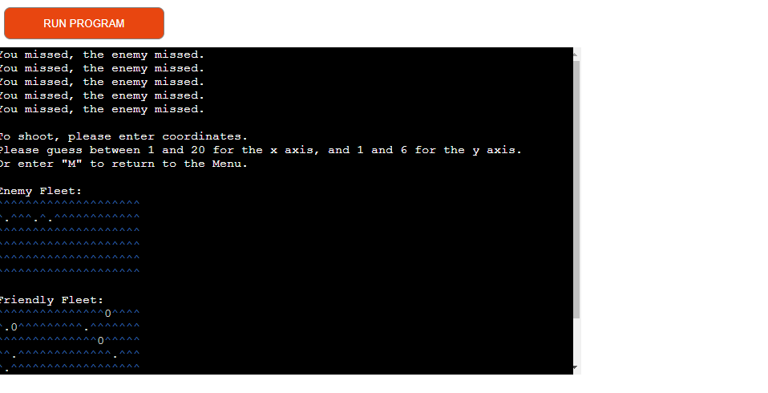
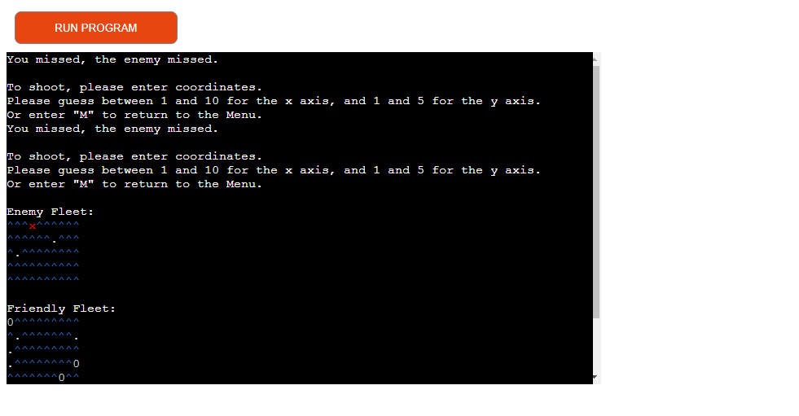

# Battleships ReadMe

In creating the game I have considered the 5 pillars of UX design:

### Strategy
The aim is to produce a battleships game played by a user to showcase use of the Python programming language. The programme should utilise principals of object orientated programming and good user experience.

With the growth in popularity of mobile devices users enjoy having entertainment wherever they go. Users enjoy playing games as a way of passing time commuting or queuing, for example. Mobile games are cheaper than console or PC games. The game will therefore be designed for solo play against the computer. The player will have the option to control the game size and choose where to target their shot.

I created the below pseudocode to outline the steps I would take.

### Structure
The game uses the Python programming language.

To allow users to change the size of the game I have placed all aspects which control this into a single class, with methods to control the game size, generate the game area and add ships dependent on the game size the user selects. The advantage of using a class was that it is easier to change the game parameters (the size of the x and y axis and the number of ships) even at the very end of programming. This proved useful once deployed, as Heroku produced errors when too much data was displayed on the screen. This is detailed in the testing section. Should other hosting platforms be available it will be easy to modify the game.

 The game takes place on a grid, positions on which can be indicated by the coordinates of an x (horizontal) and y (vertical) axis. This is represented by generating a list of lists, where the y axis is the list of lists, with each x axis as a sub list. The length of the x axis list and number of these lists is predetermined depending on what size game the user selects.

Once the lists are generated, a number of 'ships'  are allocated to different indexes in the list using the imported random library. The number of ships is also dependent on the size of the game.
This process happens twice. Once for a game area for the user to target, and once for the players own game area. A function replaces ship icons with wave icons in the area the user will be targeting so as to 'hide' the ships. It was necessary to copy this list as a version with the ships on is needed to check the player guess against.

The game begins by asking the user to select a game size, which triggers a pre-defined combination of x and y axis sizes and number of ships in the game. The game is played by asking the player to guess an X axis followed by a Y axis, giving an index of the list of lists (the 'y' axis) and an index of this list (the 'x' axis). If a 'ship' (i.e. a '0') is at this position, it is replaced by a 'hit' (an 'x'). Note that 1 is deducted from the player x and y axis guesses, as the index if the lists begins at 0. i.e. a user wishing to guess the first place on the x axis would input 1, but this would need to be translated to a 0 to indicate the first item in a list.

Once this happens the computer randomly selects values for the z and y axis which is checked against the players game area using the same function.

The game is played until either the targets or users ships are all sunk. The user is given the option of either playing again or quitting.

### Skeleton
I have chosen the below text for use in the game as being reasonably intuitive.
'^' = a wave.
'0' = a ship
'.' = a miss.
'x' = a hit.

Users are provided with textual feedback as to whether or not they or the computer has hit or missed in any particular turn.

So the grid will be displayed in a visually interesting way, and to support the player in choosing a grid, a function adds a newline to the end of every list.

### Surface
Whilst hosting the game in the command terminal necessarily limits the scope for design, I have chosen to make use of naval terminology to give users some level of immersion. When selecting game size the options are 'Midshipman', 'Captain' or 'Admiral', rather than small, medium or large, for example. The images below show the relative sizes of the games and how many "ships" are part of each game. To improve user experience I have added the Colorama package to distinguish between items on the screen and add visual interest. The waves are blue and the ships white. Hits are in red and misses in white.

#### Midshipman.

#### Captain.

#### Admiral.

### Game Play
Players are presented with the screen below when opening the app, asking them to select a size of game. The player also has the option for closing the game.

Depending on their selection, players are displayed two small, medium or large size grids, one for the computer (the 'enemy'), and one for theirs. The Computers ships are 'hidden' on the grid.

Players are instructed to enter a guess for the x and y axis. Once they have, the screen refreshes and the boards are updated with either a red cross ('X') or white dot ('.') for a hit and miss respectively. There is also textual feedback as to the result.

The image below gives an idea of a game in progress. Note the textual feedback at the very top and hits and misses on both boards.

The game play cycle continues until either one side loses all their ships, or the player chooses to return to the home screen by entering the letter 'm'. Note that it is not possible to save the game if this option is chosen.

The below image shows an example of the screen at the end of game play. If the player chooses they return to the home screen to select another game. Note that it is possible for both player and computer to loose! 

### Error messages
The error messages below are returned when:

If an invalid game size option is presented

If letter or special character is entered when selecting game size.

If an invalid x axis coordinates are entered

If an invalid x axis coordinates are entered

Further details of these tests can be seen below.

## Testing

### Validation.
The programme was run through the Code Institute [pep8 linter]('https://pep8ci.herokuapp.com/') with no issues.

### Tests performed

| Test   |      Pass      |      Result      |
|----------|:-------------:|:-------------:|
| Player can only enter valid number to select game size | ✔ | Message gives feedback explaining errors given to players. Player asked to choose again. |
| Player can only enter numbers, not letters or special characters to select game size | ✔ | Message gives feedback explaining errors given to players. Player asked to choose again. |
| Player can only enter valid target coordinates | ✔ | Message gives feedback explaining errors given to players. Player asked to choose again. |
| Player can target any valid coordinates | ✔ | N/A |
| Valid coordinates changes depending on game size | ✔ | N/A |
| Player gets visual and textual feedback of result | ✔ | Message tells player if they and computer hit or missed. |
| Computer can hit any grid square | ✔ | N/A |
| Programme tracks ships remaining. Game ends when any side is reduced to zero | ✔ | N/A|
| Computer won't target the same grid square twice | ✔ | N/A |
| Latest version of programme deployed to Heroku | ✔ | N/A |

The programme was subject to extensive manual testing until the above criteria were met. Several bugs had to be resolved.

A bug was found in the function which hid the ships in the enemy board. The function identifies any list items which are ships ('i.e '0') and replaces the ship with waves ('^') The original function mistakenly used the append method, leading to the wave being inserted at the end of the list, after the newline. Updating the function to use the insert method corrected this problem.

Based on user feedback I added a clear function to clear the screen when a game size was selected and after each game round. This improved user experience and performance over long games. However it created an error whereby if more data was displayed than could be fit in the screen not all data was cleared, as in the images below. This typically happened in either the larger game, or when input error caused error messages to be displayed (in the original version of the game these were appended to the bottom).

In the example below the textual feedback has not been deleted

In the example below the instructions haven't been correctly deleted.

The issue appeared to be a limitation of Heroku. The error didn't occur when the game was tested in the command line interface, and using several methods of clearing data produced the same results. Whilst the functioning of the game wasn't affected, it could be confusing to the user. The resolution was to reduce the size of the largest game, and add clear the screen before error messages are shown during gameplay. Extensive manual testing has shown this to be successful.

## Deployment
The application was created on Gitpod using The Code Institute template (https://github.com/Code-Institute-Org/p3-template) and VS Code Plugin and deployed to Github with the following steps:

Login to Github, otherwise create an account.

Navigate to the repository ('Explore -> 'ewradcliffe/Guess-the-country') or follow the link (https://github.com/ewradcliffe/Battleships).

Once in the repository navigate to the 'Settings' tab.

Navigate to the 'Pages' section, select the branch to deploy and save the changes.

Please note that to save any changes:

Save as usual

To commit changes, enter 'git add .' in the terminal and then enter 'git commit -m "summerise changes."
Once all changes are made use the command 'git push' to push changes to github.

##### To fork:

Click fork in the top right hand corner, and create new fork.

Confirm the owner of the fork, the repository name and description.

Click "Create fork".

##### To clone:

To clone, you must first fork the repository as per above.

Click on the "Code" button and copy the URL.

In Git Bash, navigate to the location you would like to create the cloned directory.

Enter git clone, paste the URL, and press enter.

##### Heroku

The programme is deployed on Heroku ('https://ed-radcliffe-battle-ships-2fd2088ab388.herokuapp.com/')

The Heroku app will update automatically, however this can take a couple of hours.

To create a separate app (e.g. if you have forked the original), navigate to ('https://heroku.com') and either login, or follow the steps to create an account.

To create a new app navigate to the dashboard, click on the 'New' button and click 'Create new app' from the dropdown. Give the app a name, select your region and click create app. Please note that app names need to be unique to the platform as a whole. Heroku will not accept spaces as characters. You will need to use hyphens.

Navigate to the 'Settings' tab. You will need to add a Config Var called 'Port' and set this to '8000'. Please then add the two buildpacks below. Please note that they should be added in this order. You can drag-and-drop them to rearrange if needed.

1. `heroku/python`
2. `heroku/nodejs`

Navigate to the 'Deployment' tab. You will have the option to set up automatic deployment so the app is automatically updated with any changes pushed to github.

Then connect your GitHub repository and deploy as normal.

## Future development.

Code must be placed in the `run.py` file in the Python language.

Dependencies must be placed in the `requirements.txt` file

Do not edit any of the other files or your code may not deploy properly
