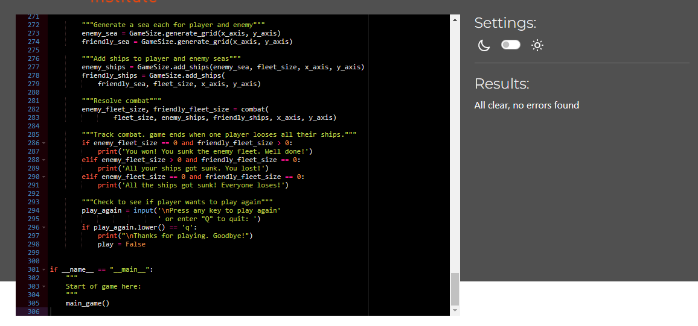

# Battleships ReadMe

In creating the game I have considered the 5 pillars of UX design:

### Strategy
The aim is to produce a battleships game played by a user to showcase use of the Python programming language. The programme should utilise principals of object orientated programming and good user experience.

With the growth in popularity of mobile devices users enjoy having entertainment wherever they go. Users enjoy playing games as a way of passing time commuting or queuing, for example. Mobile games are cheaper than console or PC games. The game will therefore be designed for solo play against the computer. The player will have the option to control the game size and choose where to target their shot.

### Structure
The game uses the Python programming language.

To allow users to change the size of the game I have placed all aspects which control this into a single class, with methods to control the game size, generate the game area and add ships dependent on the game size the user selects. The game takes place on a grid, positions on which can be indicated by the coordinates of an x (horizontal) and y (vertical) axis. This represented by generating a list of lists, where the y axis is the list of lists, with each x axis as a sub list. The length of the x axis list and number these lists is predetermined depending on what size game the user selects.

Once the lists are generated, a number of 'ships'  are allocated to different indexes in the list using the imported random library. The number of ships is also dependent on the size of the game.
This process happens twice. Once for a game area for the user to target, and once for the players own game area. A function replaces ship icons with wave icons in the area the user will be targeting so as to 'hide' the ships. It was necessary to copy this list as a version with the ships on is needed to check the player guess against.

The game begins by asking the user to select a game size, which triggers a pre-defined combination of x and y axis sizes and number of ships in the game. The game is played by asking the player to guess an X axis followed by a Y axis, giving an index of the list of lists (the 'y' axis) and an index of this list (the 'x' axis). If a 'ship' (i.e. a '0') is at this position, it is replaced by a 'hit' (an 'x'). Note that 1 is deducted from the player x and y axis guesses, as the index if the lists starts at 0. i.e. a user wishing to guess the first place on the x axis would input 1, but this would need to be translated to a 0 to indicate the first item in a list.

Once this happens the computer randomly selects values for the z and y axis which is checked against the players game area using the same function.

The game is played until either the targets or users ships are all sunk. The user is given the option of either playing again or quitting.

### Skeleton
I have chosen the below text for use in the game as being reasonably intuitive.
'^' = a wave.
'0' = a ship
'.' = a miss.
'x' = a hit.

Users are provided with textual feedback as to whether or not they or the computer has hit or missed in any particular turn.

So the grid will be displayed in a visually interesting way, and to support the player in choosing a grid, a function adds a newline to the end of every list.

### Surface
Whilst hosting the game in the command terminal necessarily limits the scope for design, I have chosen to make use of naval terminology to give users some level of immersion. When selecting game size the options are 'Midshipman', 'Captain' or 'Admiral', rather than small, medium or large, for example.

## Testing
### Validation.
The programme was run through the Code Institute [pep8 linter]('https://pep8ci.herokuapp.com/') with no issues.

## Reminders

- Your code must be placed in the `run.py` file
- Your dependencies must be placed in the `requirements.txt` file
- Do not edit any of the other files or your code may not deploy properly

## Creating the Heroku app

When you create the app, you will need to add two buildpacks from the _Settings_ tab. The ordering is as follows:

1. `heroku/python`
2. `heroku/nodejs`

You must then create a _Config Var_ called `PORT`. Set this to `8000`

If you have credentials, such as in the Love Sandwiches project, you must create another _Config Var_ called `CREDS` and paste the JSON into the value field.

Connect your GitHub repository and deploy as normal.

## Constraints

The deployment terminal is set to 80 columns by 24 rows. That means that each line of text needs to be 80 characters or less otherwise it will be wrapped onto a second line.

---

Happy coding!

#### Testing. 
The initial code written to select the size of the game tested the input to see if the entry was an intager, and if so if it was equal to or less than zero, or greater than three (i.e. a test to see if the input was anything other than an integer of value 1, 2, or three). This worked in most cases. In testing however, numbers between 10 and 29 were able to get through this test (why??). I therefore rewrote the code.

Another bug was found in the function which hid the ships in the enemy board. The function identifies any list items which are ships ('i.e '0') and replaces the with waves ('^') The original function mistakanly used the append method, leading to the wave being inserted at the end of the list, after the newline. Updating the function to use the insert method corrected this problem.