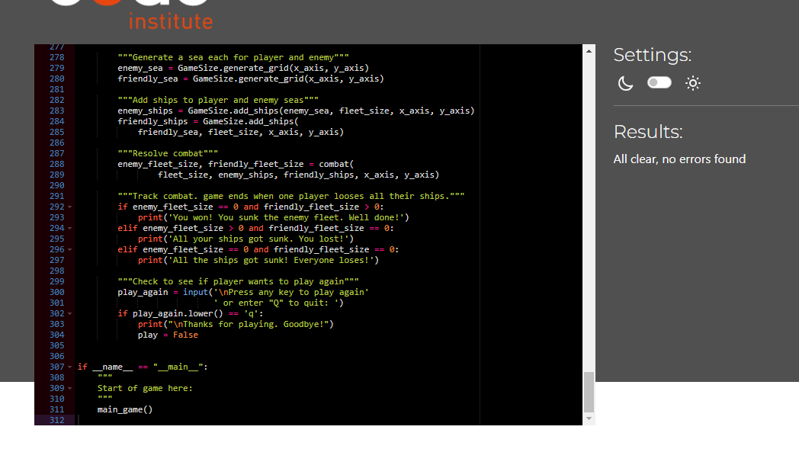

# Battleships ReadMe

In creating the game I have considered the 5 pillars of UX design:

### Strategy
The aim is to produce a battleships game played by a user to showcase use of the Python programming language. The programme should utilise principals of object orientated programming and good user experience.

With the growth in popularity of mobile devices users enjoy having entertainment wherever they go. Users enjoy playing games as a way of passing time commuting or queuing, for example. Mobile games are cheaper than console or PC games. The game will therefore be designed for solo play against the computer. The player will have the option to control the game size and choose where to target their shot.

I created the below psuedocode to outline the steps I would take.

### Structure
The game uses the Python programming language.

To allow users to change the size of the game I have placed all aspects which control this into a single class, with methods to control the game size, generate the game area and add ships dependent on the game size the user selects. The game takes place on a grid, positions on which can be indicated by the coordinates of an x (horizontal) and y (vertical) axis. This represented by generating a list of lists, where the y axis is the list of lists, with each x axis as a sub list. The length of the x axis list and number these lists is predetermined depending on what size game the user selects.

Once the lists are generated, a number of 'ships'  are allocated to different indexes in the list using the imported random library. The number of ships is also dependent on the size of the game.
This process happens twice. Once for a game area for the user to target, and once for the players own game area. A function replaces ship icons with wave icons in the area the user will be targeting so as to 'hide' the ships. It was necessary to copy this list as a version with the ships on is needed to check the player guess against.

The game begins by asking the user to select a game size, which triggers a pre-defined combination of x and y axis sizes and number of ships in the game. The game is played by asking the player to guess an X axis followed by a Y axis, giving an index of the list of lists (the 'y' axis) and an index of this list (the 'x' axis). If a 'ship' (i.e. a '0') is at this position, it is replaced by a 'hit' (an 'x'). Note that 1 is deducted from the player x and y axis guesses, as the index if the lists starts at 0. i.e. a user wishing to guess the first place on the x axis would input 1, but this would need to be translated to a 0 to indicate the first item in a list.

Once this happens the computer randomly selects values for the z and y axis which is checked against the players game area using the same function.

The game is played until either the targets or users ships are all sunk. The user is given the option of either playing again or quitting.

### Skeleton
I have chosen the below text for use in the game as being reasonably intuitive.
'^' = a wave.
'0' = a ship
'.' = a miss.
'x' = a hit.

Users are provided with textual feedback as to whether or not they or the computer has hit or missed in any particular turn.

So the grid will be displayed in a visually interesting way, and to support the player in choosing a grid, a function adds a newline to the end of every list.

### Surface
Whilst hosting the game in the command terminal necessarily limits the scope for design, I have chosen to make use of naval terminology to give users some level of immersion. When selecting game size the options are 'Midshipman', 'Captain' or 'Admiral', rather than small, medium or large, for example.

## Testing
### Validation.
The programme was run through the Code Institute [pep8 linter]('https://pep8ci.herokuapp.com/') with no issues.

The initial code written to select the size of the game tested the input to see if the entry was an intager, and if so if it was equal to or less than zero, or greater than three (i.e. a test to see if the input was anything other than an integer of value 1, 2, or three). This worked in most cases. In testing however, numbers between 10 and 29 were able to get through this test (why??). I therefore rewrote the code.

Another bug was found in the function which hid the ships in the enemy board. The function identifies any list items which are ships ('i.e '0') and replaces the with waves ('^') The original function mistakanly used the append method, leading to the wave being inserted at the end of the list, after the newline. Updating the function to use the insert method corrected this problem.

### Tests performed

| Test   |      Result      |
|----------|:-------------:|
| Player can only enter valid selection to select game size | ✔ |
| Player can only enter valid target coordinates | ✔ |
| Player can target any valid coordinates | ✔ |
| Valid coordinates changes depending on game size | ✔ |
| Player gets visual and textual feedback of result | ✔ |
| Computer can hit any grid square | ✔ |
| Computer won't target the same grid square twice | ✔ |
| Latest version of programme deployed to Heroku | ✔ |

## Deployment
The application was created on Gitpod using The Code Institute template (https://github.com/Code-Institute-Org/p3-template) and VS Code Plugin and deployed to Github with the following steps:

Login to Github, otherwise create an account.

Navigate to the repository ('Explore -> 'ewradcliffe/Guess-the-country') or follow the link (https://github.com/ewradcliffe/Battleships).

Once in the repository navigate to the 'Settings' tab.

Navigate to the 'Pages' section, select the branch to deploy and save the changes.

Please note that to save any changes:

Save as usual

To commit changes, enter 'git add .' in the terminal and then enter 'git commit -m "summerise changes."
Once all changes are made use the command 'git push' to push changes to github.

##### To fork:

Click fork in the top right hand corner, and create new fork.

Confirm the owner of the fork, the repository name and description.

Click "Create fork".

##### To clone:

To clone, you must first fork the repository as per above.

Click on the "Code" button and copy the URL.

In Git Bash, navigate to the location you would like to create the cloned directory.

Enter git clone, paste the URL, and press enter.

##### Heroku

The programme is deployed on Heroku ('https://ed-radcliffe-battle-ships-2fd2088ab388.herokuapp.com/')

The Heroku app will update automatically, however this can take a couple of hours.

To create a separate app (e.g. if you have forked the original), navigate to ('https://heroku.com') and either login, or follow the steps to create an account.

To create a new app navigate to the dashboard, click on the 'New' button and click 'Create new app' from the dropdown. Give the app a name, select your region and click create app. Please note that app names need to be unique to the platform as a whole. Heroku will not accept spaces as characters. You will need to use hyphens.

Navigate to the 'Settings' tab. You will need to add a Config Var called 'Port' and set this to '8000'. Please then add the two buildpacks below. Please note that they should be added in this order. You can drag-and-drop them to rearrange if needed.

1. `heroku/python`
2. `heroku/nodejs`

Navigate to the 'Deployment' tab. You will have the option to set up automatic deployment so the app is automatically updated with any changes pushed to github.

Then connect your GitHub repository and deploy as normal.

## Future development.

Code must be placed in the `run.py` file in the Python language.

Dependencies must be placed in the `requirements.txt` file

Do not edit any of the other files or your code may not deploy properly
